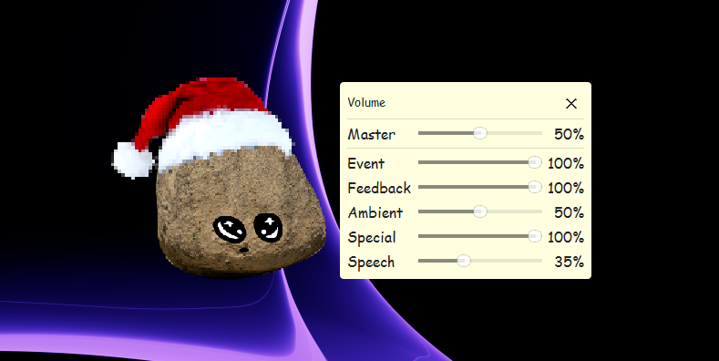

# Onlooking Rock

 

affectionattely known as "rockin", it is a desktop sprite that watches your screen, reacts to your activity, chats via speech bubbles, and lets you decorate your monitors with tiny props.

it ships with sound, multi-monitor overlays, and a small UI suite to tweak volume, sprite cosmetics, and scene decorations.

## Quick start

1) Prereqs: Python 3.10+
2) Install deps: `pip install -r requirements.txt`
3) Run: `python -B -m src.controller`

## Features

  

- it watches you work!
- rock customisation through interchangable, and custom hats
- reactive sprite moods based on keyboard activity and idle time
- you can give your new friend head pats
- speech bubbles with typing animation and interactive prompts
- drag the sprite; right-click to open the start menu overlay
- volume, sprite, and scene editors (tool windows) with smooth fade/positioning
- multi-monitor decoration overlays with drag/drop placement and persistence
- sound system with categories (event, feedback, ambient, special, speech)

## Configuration

  

defaults live in `src/assets/baseConfig.json`: user overrides are stored under your OS config dir (`OnlookinRock/profiles/profile.json`).

Common keys:
- `sprite.scale`, `sprite.hat`, `sprite.refreshRates.*`
- `sound.masterVolume`, `sound.categoryVolumes.*`
- `scene.startupDecorationSpawnCount`, `scene.persistentDecorations`

## Controls

- drag: left-click and hold the sprite
- menu: right-click the sprite or press `E`
- quit: `Esc` from the sprite window, or in the menu
