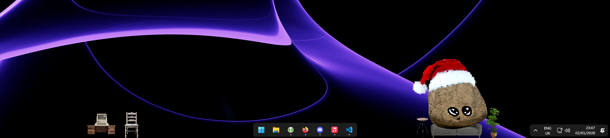
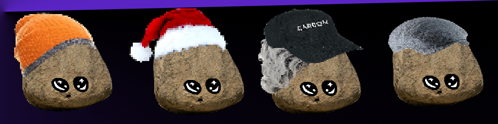

# 🪨 Onlooking Rock

<br/>

affectionattely known as "rockin", its a desktop sprite that watches your screen, reacts to your activity, chats via speech bubbles, and lets you decorate your monitors with tiny props.

it ships with sound, multi-monitor overlays, and a small UI suite to tweak volume, sprite cosmetics, and scene decorations.

## Awesome Features

<br/><br/>

- it watches you work! (but respects your privacy)
- rock customisation through interchangable, and custom hats
- reactive sprite moods based on keyboard activity and idle time
- you can give your new friend head pats
- speech bubbles with typing animation and interactive prompts
- drag the sprite; right-click to open the start menu overlay
- randomised events! rockin' will randomly select one to run at intervals
- volume, sprite, and scene editors (tool windows) with smooth fade/positioning
- multi-monitor decoration overlays with drag/drop placement and persistence
- sound system with categories (event, feedback, ambient, special, speech)

## Quick start

1) download from [releases](https://github.com/cyberahree/OnlookingRock/releases)
2) run rockin.exe!

## Building from Source

written in python, you can run it directly from the source (as shown above) or build it with pyinstaller

1. pre-requirements:
Python 3.10+, pip

2. setup
`git clone https://github.com/cyberahree/OnlookingRock.git`
`cd OnlookingRock`
`pip install -r requirements.txt`
`pip install pyinstaller`

3. build
```bash
python3 -m PyInstaller --noconfirm --clean --windowed --name Rockin ^
  --paths src ^
  --add-data "src\assets;assets" ^
  --collect-submodules controller.events.modules ^
  src\run.py
```

4. done
your executable file will be generated at `./dist/Rockin/`

## Configuration

<br/><br/>

defaults live in `src/assets/baseConfig.json`: user overrides are stored under your OS config dir (`OnlookinRock/profiles/profile.json`).

Common keys:
- `sprite.scale`, `sprite.hat`, `sprite.refreshRates.*`
- `sound.masterVolume`, `sound.categoryVolumes.*`
- `scene.startupDecorationSpawnCount`, `scene.persistentDecorations`

## Controls

- drag: left-click and hold the sprite
- menu: right-click the sprite
- quit: `Esc` when focused on the sprite, or in the menu
